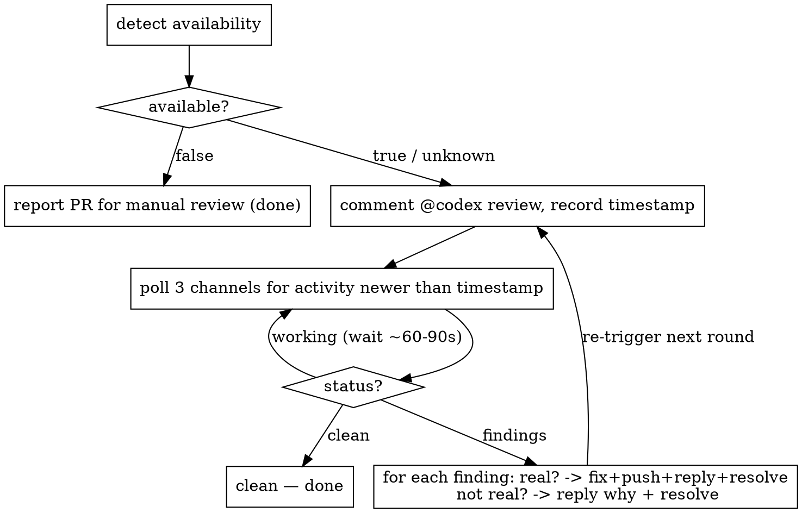

# Codex Review Loop

## Overview

Drive the GitHub Codex connector (`chatgpt-codex-connector`) through a complete
review-address-resolve cycle on a PR until it reports no major issues. Codex reviews
asynchronously and signals its outcome across **three different channels**, with a
non-obvious terminal "clean" signal — a naive poller misses it and hangs.

**Core principle:** detection and polling are mechanical (use the bundled script);
deciding whether a finding is real and how to fix it is judgement (yours).

## When to use

- A PR was just opened or updated and needs review before merge.
- You're told to "run the codex loop", comment `@codex review`, or "address Codex feedback".
- A task-end / pre-merge gate requires a clean Codex pass.

Not for: human review threads, or CI checks — this is specifically the Codex bot.

## The loop



## Quick reference

The script ships with this skill. Reference it via the plugin root so it works whether the
skill is invoked directly or as a dependency of another plugin:

```bash
SCRIPT="${CLAUDE_PLUGIN_ROOT}/skills/codex-review-loop/codex-review-loop.sh"
```

| Step | Command |
|------|---------|
| Detect | `"$SCRIPT" detect --repo OWNER/NAME` |
| Trigger | `TS=$("$SCRIPT" trigger --repo OWNER/NAME --pr N)` |
| Poll | `"$SCRIPT" poll --repo OWNER/NAME --pr N --since "$TS"` |
| Reply (inline) | `gh api repos/OWNER/NAME/pulls/N/comments/ID/replies -f body=...` |
| Resolve thread | GraphQL `resolveReviewThread` (map comment→thread first) |

`detect` returns `available: true | false | "unknown"`. Treat **`"unknown"` as "trigger and
decide empirically"** — never skip the loop on inconclusive detection; only declare
unavailable if the full normal review window (~2–6 min / all poll rounds) elapses with no
Codex response. `poll` returns `{status: clean|findings|working, respondedAt, findings[]}`.

See `"$SCRIPT" --help` for the full interface; the pure `classify` and `detect-classify`
actions accept `--input` for offline testing.

## Addressing findings (judgement)

For each finding from `poll`:
1. **Decide if it is a real issue first.** If not, reply on the thread explaining why it's
   a non-issue and resolve it — do not change code.
2. If real: implement the fix, push to the PR branch, reply on the thread with a
   **detailed explanation of the fix** (reference the commit), and mark the thread resolved.
3. After a round is addressed, **re-trigger** (`trigger` again with a fresh timestamp) and
   keep polling. Repeat until `status == clean` (bounded — cap rounds, ~8 — to avoid loops).

Resolve inline threads via GraphQL: query `reviewThreads` to map a comment `databaseId` to
its thread node id, then `resolveReviewThread(input:{threadId})`.

## Critical gotchas

- **Three channels.** Poll all of: `issues/{pr}/comments` (top-level), `pulls/{pr}/reviews`,
  `pulls/{pr}/comments` (inline). Findings arrive as reviews + inline comments.
- **The clean signal is a top-level issue comment**, not silence and not an empty review:
  body matches *"Didn't find any major issues"* (also "no issues" / "looks good" / 👍).
  Watching only inline comments treats "finished, found nothing" as "still working" → hangs.
- **A clean issue-comment is terminal** — stop the loop; don't run more rounds in the batch.
- **Bot login** is `chatgpt-codex-connector`; tolerate the `[bot]` suffix when matching.
- **`detect` is best-effort & positive-only.** App-install listing needs an App-authorized
  token (a user token 401/403s), so a fresh repo returns `"unknown"`, not `false`. Absence
  of evidence is never a false negative.
- **The review banner is not a finding.** Codex posts a "💡 Codex Review" wrapper review;
  ignore it as actionable content — act on the inline comments / findings it carries.

## Testing the script

```bash
bash skills/codex-review-loop/tests/run.sh   # pure classify + detect-classify paths
```

## Real-world impact

The terminal-signal and three-channel rules come from a real failure: a poller that watched
only `pulls/{pr}/reviews` + inline comments stayed armed ~25 min while Codex had already
posted "Didn't find any major issues" as an issue comment within ~5 min.
